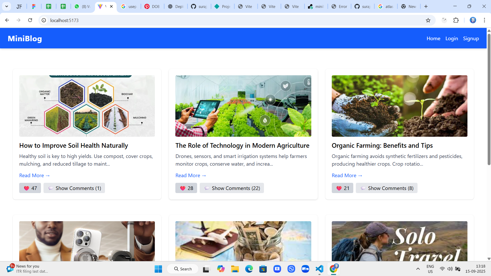
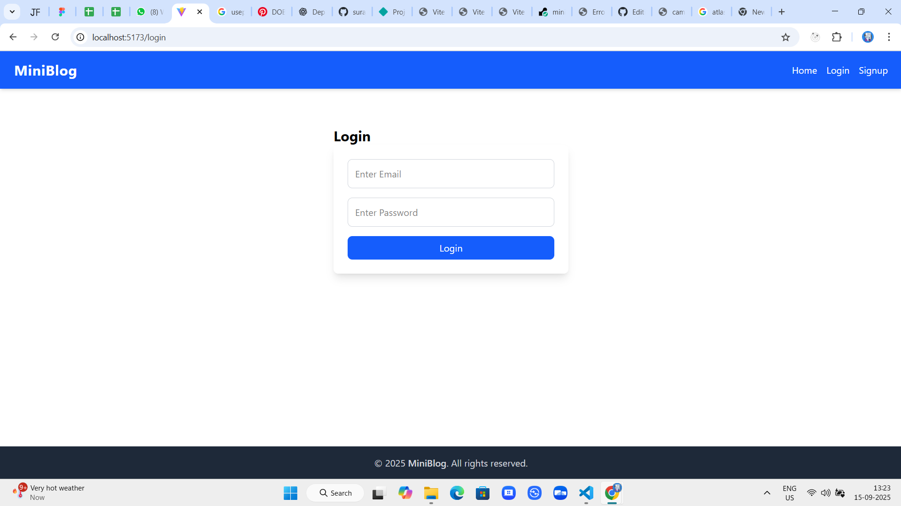

# MiniBlog

MiniBlog is a modern, lightweight blogging platform built with **React** and **Tailwind CSS**. It allows users to **create, edit, and share posts** with ease. The platform is fully responsive and emphasizes simplicity, speed, and a clean user experience.

## Features

- User authentication (signup, login, logout)  
- Create, edit, and delete posts  
- Upload images for posts  
- View all posts and individual post details  
- Responsive design for desktop and mobile  
- Clean, modern UI with Tailwind CSS  

## Screenshots

  
  
  
- **Database:** MongoDB (via backend API)  

## Installation

1. **Clone the repository**  
```bash
git clone https://github.com/surajpxl/miniblog.git
cd miniblog

Install dependencies

npm install


Start the development server

npm run dev


Open in browser
Visit http://localhost:5173 (Vite default)

Make sure your backend API is running at http://localhost:5000 or update the API URLs accordingly.

Usage

Signup/Login: Create a new account or login to manage your posts.

Create Post: Add a title, content, and optionally upload an image.

Edit/Delete Post: Manage your own posts from the post detail page.

View Posts: Browse all posts publicly.

Folder Structure
src/
 ├─ components/    # Reusable components like Navbar, PostForm
 ├─ pages/         # Page components (Home, Create, Edit, PostDetail)
 ├─ App.jsx        # Main App component
 └─ index.jsx      # Entry point

Future Improvements

Add pagination for posts

Add comments and likes functionality

Dark mode toggle

Optimize image uploads and storage

Contributing

Contributions are welcome! Please fork the repository and create a pull request with your changes.

License

This project is licensed under the MIT License.

MiniBlog – A clean, responsive blogging platform for sharing your ideas easily.


